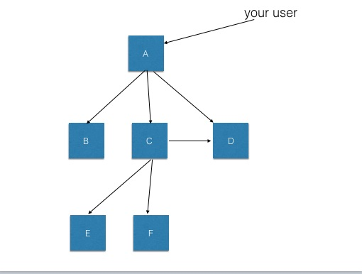

# XRequestUidBundle

## Why ?

*"The cool thing in microservices is that you can generate 15 http calls in your infrastructure just with on client http call"*  



This situation leads to many difficulties to trace calls betweens APIs systems, especially when an internal call fails. This bundle provide a solution to generate ids for new requests and configure your guzzle services accordingly to uses those ids in sub http requests made by them.

The bundle will generate and/or transfert those two headers : X-Request-Uid and X-Request-Parent-Uid.
 
##  How ? 

When a request arrive, if a X-Request-Id exists, it is copied into the X-Request-Parent-Id. If it's dont exist we generate it throught the uniqId_service. 

All your guzzle services are decorated with a proxy who will add the two headers in all the call made. 

At the end both headers are added to the response for debugging purpose.


You can now add thoses two headers in your logs file and follow the calls.

## Configuration

```yml 
m6_web_x_request_uid:
    request_uid_header_name: X-Request-toto    # optionnal, X-Request-Uid by default
    request_parent_uid_header_name: X-Parent   # optionnal, X-Request-Parent-Uid by default 
    uniqId_service: myservice                  # optionnal, a service implementing UniqIdInterface 
    services:                                  # list of guzzle services to decorate 
        - test.guzzle1

services:
    test.guzzle1:
        class: 'GuzzleHttp\Client'

```

If you have other bundles creating guzzle services, be sure to add the bundle after them in your `AppKernel` file.

You can define you own uniqId service or juste use the one provided in the bundle (wich do a basic php `uniqid`).

## Related

* Use The [GuzzleHttp Bundle](https://github.com/M6Web/GuzzleHttpBundle) to instanciate your guzzle services.
* Use the [LogBridge Bundle](https://github.com/M6Web/LogBridgeBundle) to see responses when a problem occurs. 


## Todo 

 * add more tests
 * add more docs

